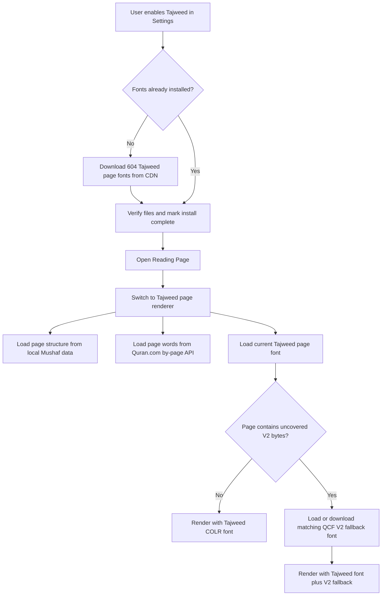

# Tajweed Implementation Spec For Copilot

Use this document as the implementation contract when building the same Tajweed feature in another Flutter app.
This is intentionally written for Copilot to execute, not just for humans to read.

## Ready-To-Paste Copilot Prompt

Paste the block below into Copilot Chat in the other app.

```text
Implement a production-ready Tajweed Quran reader in this Flutter app.

Use a page-based renderer built on downloadable per-page QCF V4 COLR fonts.
Do not use image-based Tajweed rendering.

Reuse the host app's existing Mushaf/page/ayah navigation architecture where possible.
If the app does not already have equivalent abstractions, create them.

The implementation must include:
- a Tajweed settings toggle,
- one-time download of 604 Tajweed page fonts,
- page-based Tajweed rendering,
- runtime font loading with FontLoader,
- Quran.com by-page word loading using mushaf=19,
- fallback to local Mushaf page-line rendering if the API fails,
- V2 Mushaf font fallback for glyphs missing from the V4 Tajweed pack,
- the QCF U+007F alias patch for V2 fonts,
- startup migration that clears any old image-based Tajweed cache,
- deletion/reset support,
- focused validation for the font patcher and mapping logic.

Keep the code production-ready and wired end to end.
Do not stop at scaffolding.
After the implementation, run relevant analysis/tests.

Follow the full spec in TAJWEED_IMPLEMENTATION.md.
```

## Objective

Build a font-based Tajweed reader with the same behavior as the implementation in this repo.

The target experience is:

1. The user enables Tajweed from Settings.
2. The app downloads a pack of 604 Tajweed page fonts.
3. The reader switches from the normal Mushaf renderer to the Tajweed renderer.
4. Each page renders using:
     - local Mushaf page structure,
     - Quran.com word-level Tajweed data,
     - the page-specific Tajweed COLR font.
5. If the Tajweed font is missing some glyphs, the page still renders correctly using a QCF V2 fallback font.

## Non-Negotiable Constraints

Copilot must follow these constraints exactly:

- Do not implement Tajweed as image downloads or cached word images.
- Keep the renderer page-based, not verse-card based.
- Use per-page Tajweed fonts stored locally on device.
- Use `FontLoader` for runtime page font loading.
- Use Quran.com by-page word data with `mushaf=19`.
- Preserve rendering when the API fails by falling back to database line rendering.
- Add V2 fallback for uncovered glyph bytes above `0xAE`.
- Patch QCF V2 fonts so the `0x7F` glyph remains renderable in Flutter.
- Auto-disable Tajweed if the font pack is missing after reinstall/delete.

## Host App Integration Points

If the other app already has equivalents for these concepts, reuse them.
If not, create them.

Required host capabilities:

- a page-based Mushaf reader or equivalent page navigation surface,
- a local Mushaf page data source,
- current surah/ayah selection state,
- a Settings screen or preferences surface,
- local file storage via `path_provider`,
- persisted key-value storage via `shared_preferences` or equivalent.

Minimum local page data needed from the host app:

- page lines,
- surah heading rows,
- bismillah rows,
- page metadata,
- surah header glyphs or equivalent header content.

If the host app uses Riverpod, Bloc, Cubit, or another state layer, adapt the provider pieces to that pattern but preserve the same responsibilities and behavior.

## Required Packages

Copilot should add or reuse the following packages if they are not already present:

- `http`
- `path_provider`
- `shared_preferences`
- `archive`
- `provider` only if the host app already uses Provider or if no state pattern exists yet

Optional depending on host UI:

- `flutter_svg` for surah header assets

## Suggested File Layout

Adapt names if the host app uses a different module structure, but keep the same separation of concerns.

```text
lib/
    tajweed/
        services/
            tajweed_font_download_service.dart
            tajweed_font_service.dart
        presentation/
            providers/
                tajweed_page_provider.dart
            widgets/
                tajweed_page_view.dart
    mushaf/
        services/
            qcf_font_patcher.dart
            qcf_font_service.dart
            font_download_service.dart
    settings/
        ... Tajweed toggle integration
    main.dart
```

## Components To Implement

### 1. Startup Migration

Implement a one-time migration that runs on app startup.

Behavior:

- delete any old image-based Tajweed cache directories if they exist,
- remove old Tajweed preference keys,
- mark the migration as completed so it does not run again.

Expected method:

- `TajweedFontDownloadService.runMigrationIfNeeded()`

Suggested stale directories to remove if they existed in the previous app:

- `tajweed_words`
- `tajweed_word_cache`

Suggested persisted migration key:

- `tajweed_migration_v2_done`

### 2. Tajweed Download State Layer

Create a state holder responsible for the full Tajweed feature lifecycle.

Responsibilities:

- whether Tajweed is enabled,
- whether the font pack is installed,
- whether a download is in progress,
- current download progress,
- current error state,
- delete/reset behavior,
- recheck install status after startup or resume.

Suggested persisted keys:

- `isTajweedEnabled`
- `tajweed_fonts_installed`
- `tajweed_fonts_version`

Required behavior:

- if the user enables Tajweed and fonts are not installed, prompt download,
- if the download finishes successfully, enable Tajweed automatically,
- if the fonts are missing later, disable Tajweed automatically,
- if the user deletes the font pack, disable Tajweed immediately.

### 3. Tajweed Font Pack Download Service

Implement a download service for the per-page Tajweed COLR font pack.

Responsibilities:

- download `p1.ttf` through `p604.ttf`,
- store them in `{applicationDocumentsDirectory}/tajweed_fonts/`,
- verify all 604 files exist before marking install complete,
- support cancellation,
- support deletion/reset,
- version the install state.

Required design details:

- total pages: `604`,
- one local TTF per page,
- batched parallel download is acceptable and recommended,
- a batch size around `10` is fine,
- verification should count `.ttf` files and reject incomplete installs.

Suggested API:

- `Future<Directory> get fontsDir`
- `Future<bool> get isInstalled`
- `Stream<double> downloadFontPack()`
- `void cancel()`
- `Future<void> deleteFontPack()`
- `static Future<void> runMigrationIfNeeded()`

### 4. Tajweed Runtime Font Loader

Implement a runtime page-font loader for Tajweed fonts.

Responsibilities:

- resolve the page-local font file,
- load it with `FontLoader`,
- cache loaded families using LRU behavior,
- preload adjacent page fonts,
- throw a domain-specific error if a page font is not installed.

Required design details:

- family pattern: `TAJWEED_PNNN`,
- max cached page fonts: `10`,
- if the same family is already loading, wait for that load instead of starting a duplicate.

Suggested API:

- `static String familyForPage(int pageNo)`
- `Future<String> ensurePageFont(int pageNo)`
- `Future<void> preloadAdjacent(int pageNo, {int totalPages = 604})`
- `Future<bool> isFontAvailable(int pageNo)`

Suggested domain error:

- `TajweedFontNotInstalledError`

### 5. Tajweed Page Data Provider

Implement a page data provider that merges local Mushaf structure with remote Tajweed word data.

Local data source must provide:

- page lines,
- page meta,
- surah headers,
- bismillah lines,
- surah meta if the UI shows it.

Remote data source must call Quran.com by page:

```text
/verses/by_page/{page}?words=true&word_fields=code_v2,text_qpc_hafs,char_type_name,line_number,page_number&mushaf=19
```

Required behavior:

- fetch the current page only,
- parse verse words,
- group words by `line_number`,
- expose a structure equivalent to `Map<int, List<TajweedPageWord>> wordLinesByVisualLine`,
- if the API fails, keep page rendering alive by leaving API word lines empty and falling back to database line rendering.

Suggested word model fields:

- `surahId`
- `ayahId`
- `position`
- `lineNumber`
- `pageNumber`
- `charTypeName`
- `codeV2`
- `textQpcHafs`

### 6. Tajweed Page Renderer

Implement a page widget equivalent to `TajweedPageView`.

Responsibilities:

- resolve the visible page from the selected surah/ayah,
- load page data,
- load the Tajweed page font,
- render portrait and landscape layouts,
- handle swipe or button page navigation,
- sync visible page back to the app's reading state,
- optionally highlight the target ayah when navigating from translation.

Required rendering behavior:

- prefer API word-line rendering when available,
- otherwise render from local database line text,
- render surah headings and bismillah using the existing ornamental/QCF heading font path,
- show a clear locked/download-needed state if Tajweed fonts are not installed.

### 7. Reader Switching

Integrate Tajweed into the reader entry point.

Required rule:

- use the Tajweed reader only when Tajweed is enabled and the Tajweed font pack is installed.

Otherwise:

- keep using the normal Mushaf reader.

### 8. Settings Integration

Add a Tajweed toggle to Settings.

Required behavior:

- if the user turns it on and fonts already exist, enable immediately,
- if the user turns it on and fonts do not exist, show a confirmation dialog and start the download,
- show progress while downloading,
- allow cancellation,
- allow deletion of downloaded Tajweed data,
- after delete, disable Tajweed.

## Critical Rendering Rules

These rules are the part most likely to break if Copilot simplifies the implementation too much.

### Quran.com API usage

Use the by-page endpoint with these word fields:

- `code_v2`
- `text_qpc_hafs`
- `char_type_name`
- `line_number`
- `page_number`

The request must include:

- `mushaf=19`

### QCF V4 mapping logic

The Tajweed font pack is QCF V4 COLR, but much of the existing page data is QCF V2-oriented.

Required behavior:

- when rendering API word lines, use `code_v2` directly as glyph text when present,
- when rendering from local database line strings, convert covered V2 bytes to the V4 range by adding offset `0xFC20`.

Covered V2 byte range:

- `0x21` through `0xAE`

That means:

- `0x21 + 0xFC20 = U+FC41`

### Visual glyph order handling

When rendering database line text:

- reverse line segments using the app's Mushaf text utility or equivalent,
- then apply the V4 offset,
- then wrap the rendered text in LRO/PDF markers so Flutter preserves the visual glyph order.

### Missing V4 glyphs

The current Tajweed font pack does not cover every V2 byte.

Required rule:

- treat bytes above `0xAE` and up to `0xFF` as uncovered by the V4 pack.

For those bytes:

- if a V2 fallback font exists, keep the original V2 byte so the fallback font can render it,
- if no V2 fallback font exists yet, substitute zero-width space instead of letting the system Arabic font render broken presentation forms.

## Required V2 Fallback Path

Do not skip this part.
It is required for correct rendering on affected pages.

### QCF V2 runtime font loader

Reuse the host app's existing Mushaf V2 font system if it already exists.
Otherwise implement one.

Responsibilities:

- load bundled or downloaded QCF V2 page fonts,
- patch them in memory before use,
- allow on-demand page-font loading,
- expose page-family names for use in `fontFamilyFallback`.

### On-demand V2 page download

If a page needs the fallback and the matching V2 page font is not installed:

- download only the ZIP that contains the required page,
- extract the page font,
- patch the font bytes,
- load it and use it as the fallback family.

### QCF patcher requirement

Implement a patcher equivalent to `QcfFontPatcher`.

Reason:

- QCF V2 uses byte `0x7F` as a valid glyph selector,
- Flutter suppresses `U+007F` as a control character,
- the font cmap must be patched so `U+E07F` points to the same glyph.

Required patch behavior:

- if the font already has the alias, do nothing,
- otherwise rebuild the cmap so `U+E07F` aliases the same glyph as `U+007F`,
- return original bytes unchanged on patch failure rather than crashing.

## Dark Mode Handling

Do not create a separate dark Tajweed font pack.

Required approach:

- apply a color matrix in dark mode so the colored glyphs remain readable on dark backgrounds while preserving their meaning.

## Acceptance Criteria

Copilot should consider the work incomplete until all items below are satisfied.

- Enabling Tajweed from Settings works.
- First-time enable prompts the user to download the Tajweed font pack.
- The app downloads and verifies all 604 Tajweed page fonts.
- After install, Tajweed becomes enabled automatically.
- The reader switches to the Tajweed renderer when Tajweed is enabled.
- The renderer loads page-specific fonts dynamically.
- The renderer fetches word lines from Quran.com by page.
- If Quran.com fails, the page still renders from local line data.
- Pages with uncovered V4 glyphs still render correctly using V2 fallback fonts.
- V2 fallback fonts are patched so the `0x7F` glyph survives Flutter text rendering.
- Deleting Tajweed data disables Tajweed.
- Reopening the app with missing fonts disables Tajweed instead of leaving the toggle in a broken state.

## Validation Requirements

Ask Copilot to validate its own implementation with the narrowest useful checks available in the target app.

Minimum validation expected:

- run `flutter analyze` on the touched files,
- add or run a focused test for the QCF patcher,
- add or run a focused test for V4 mapping or fallback logic if the host app has a test setup,
- manually verify at least one page that needs V2 fallback.

Manual checks:

1. Turn Tajweed on when nothing is downloaded.
2. Confirm the download starts and progress updates.
3. Open a page that renders only with the Tajweed pack.
4. Open a page that includes missing high-range V4 glyphs and confirm fallback rendering works.
5. Disable or delete Tajweed data and confirm the reader returns to the normal Mushaf view.

## Reference Implementation In This Repo

Use the files below as the source of truth for the existing implementation.

- `lib/tajweed/services/tajweed_font_download_service.dart`
- `lib/tajweed/services/tajweed_font_service.dart`
- `lib/tajweed/presentation/providers/tajweed_page_provider.dart`
- `lib/tajweed/presentation/widgets/tajweed_page_view.dart`
- `lib/screens/detailed_pages/provider/tajweed_page_provider.dart`
- `lib/screens/detailed_pages/reading_page.dart`
- `lib/mushaf/services/qcf_font_service.dart`
- `lib/mushaf/services/font_download_service.dart`
- `lib/mushaf/services/qcf_font_patcher.dart`

## End-To-End Flow



## Final Instruction For Copilot

Implement the feature end to end.
Do not stop at architecture notes, TODO comments, or placeholder widgets.
Preserve the behavior described above even if the host app uses different naming or state-management conventions.